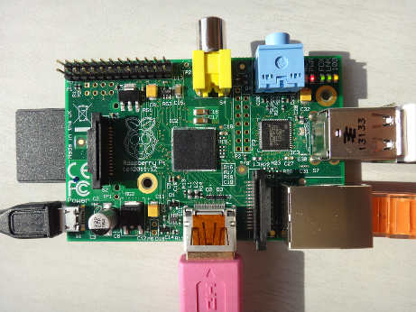

## Getting Started with Raspberry Pi

###Introduction
This lesson has been designed as an introduction to the Raspberry Pi. It could be taught as a stand alone lesson, as a workshop, or as part of a wider scheme of work to introduce students to Raspberry Pi and explain it's main features and setup.

###Students will learn:

In this lesson, students will learn 
- What a Raspberry Pi is, 
- what are it's main features, 
- and how to setup and use one.

###Computing Programme of Study Met:

**KS2:**
- Recognises that a range of digital devices can be considered a computer. Recognises and can use a range of input and output devices.

**KS3:**
- Understand the hardware and software components that make up computer systems, and how they communicate with one another and with other systems.
- Recognises and understands the function of the main internal parts of basic computer architecture.

[National Curriculum Computing Programmes of Study](https://www.gov.uk/government/publications/national-curriculum-in-england-computing-programmes-of-study/national-curriculum-in-england-computing-programmes-of-study#key-stage-3)

###Resources

For the majority of the lesson, it is suggested that work is carried out by students on a Raspberry Pi in pairs. Each pair should have access to the standard equipment described below, and a computer with a web broswer connected to the network each. As there will be multipule Raspberry Pis acting as servers some setup is required in configuring them. [See multipule coder devices setup guide](https://github.com/googlecreativelab/coder/wiki/Using-Multiple-Coder-Devices-(Lab-Setup)). In addition, it is suggested that you have your own teacher setup connected to a projector screen for demonstration purposes.

- A Raspberry Pi per pair connected to a local network;
- An [SD card with Google Coder installed](http://googlecreativelab.github.io/coder/) per RPi and configured to allow multipule coder devices; 
- A computer per student with a web browser connected to local network.

###Lesson

- [Lesson 1 - Getting Started with Raspberry Pi](/Lesson-1/lesson-plan-1.md) 

