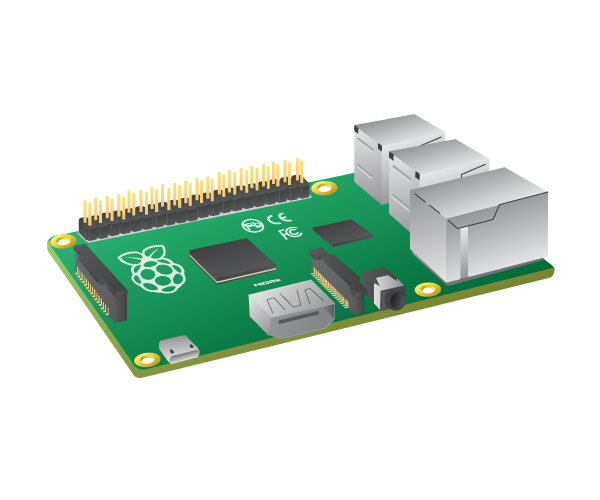

# Getting Started with Raspberry Pi

This lesson has been designed as an introduction to the Raspberry Pi. It could be taught as a standalone lesson, as a workshop, or as part of a wider scheme of work to introduce students to Raspberry Pi and explain its main features and setup.

## Students will learn:

In this lesson, students will learn

- What a Raspberry Pi is
- Its main features
- How to set up and use one

## Computing programme of study met:

### KS2

- Recognise that a range of digital devices can be considered to be a computer. Recognise and can use a range of input and output devices.

### KS3

- Understand the hardware and software components that make up computer systems, and how they communicate with one another and with other systems.
- Recognise and understand the function of the main internal parts of basic computer architecture.

[National Curriculum Computing Programmes of Study](https://www.gov.uk/government/publications/national-curriculum-in-england-computing-programmes-of-study/national-curriculum-in-england-computing-programmes-of-study#key-stage-3)

## Resources

For the majority of the lesson, it is suggested that work is carried out by students on a Raspberry Pi in pairs. Each pair should have access to the standard equipment described below. In addition, it is suggested that you have your own teacher setup connected to a projector screen for demonstration purposes.

- A Raspberry Pi per pair
- A NOOBS SD card per Raspberry Pi (with an up-to-date Raspbian installed)
- A keyboard and mouse connected to each Raspberry Pi
- A monitor connected to each Raspberry Pi
- A micro USB power adaptor
- All necessary cables

See [raspberrypi.org/downloads](http://www.raspberrypi.org/downloads/) to download NOOBS/Raspbian and see the [NOOBS setup guide](http://www.raspberrypi.org/help/noobs-setup/) for help with installation.

## Lesson

- [Lesson 1 - Getting Started with Raspberry Pi](lesson-1/lesson-plan-1.md)

## Licence

Unless otherwise specified, everything in this repository is covered by the following licence:

***Getting Started with Raspberry Pi Lesson*** by the [Raspberry Pi Foundation](http://www.raspberrypi.org) is licenced under a [Creative Commons Attribution 4.0 International Licence](http://creativecommons.org/licenses/by-sa/4.0/).

Based on a work at https://github.com/raspberrypilearning/getting-started-with-raspberry-pi-lesson
